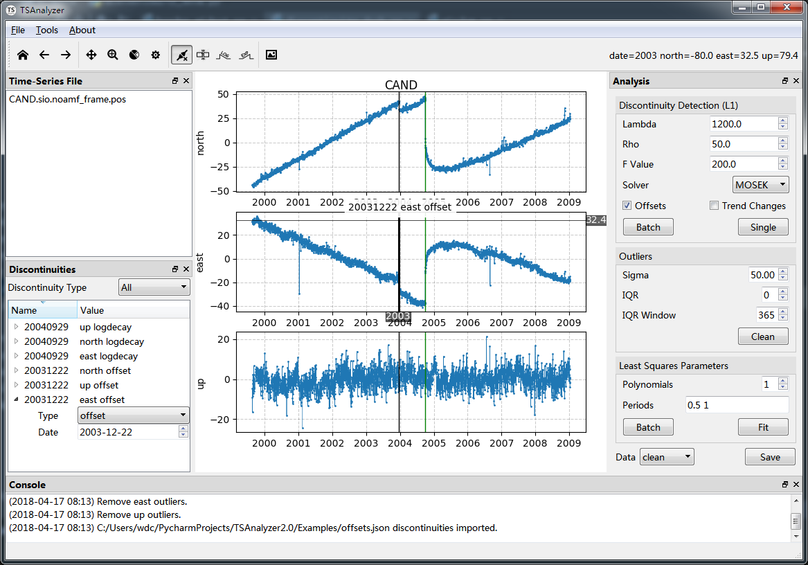
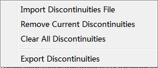
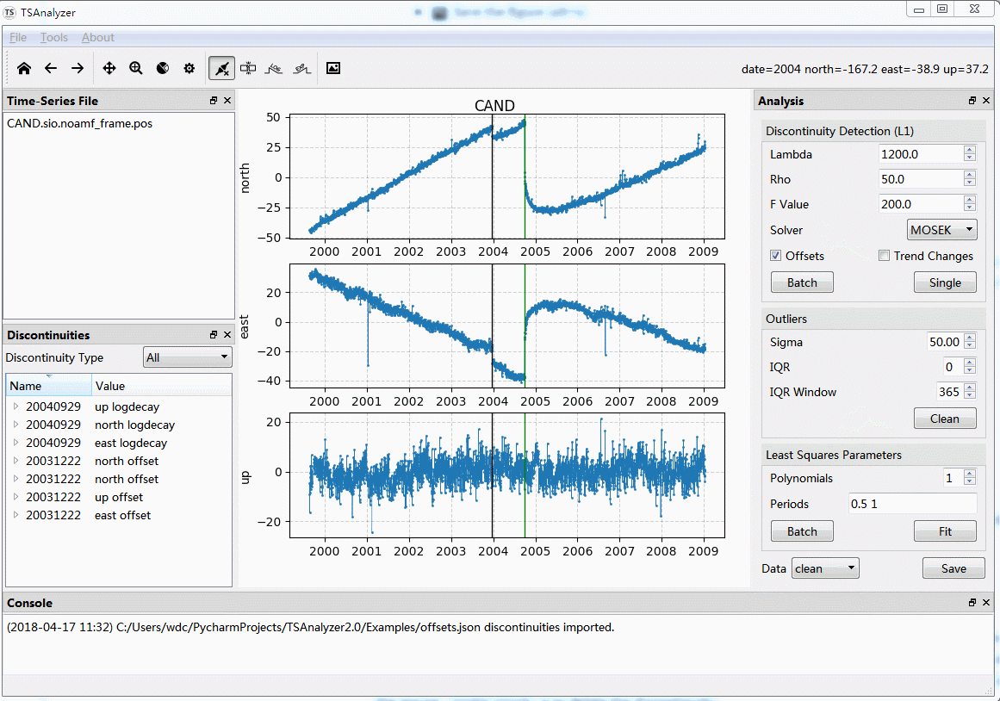
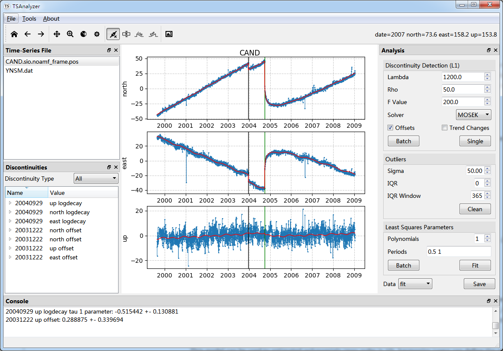
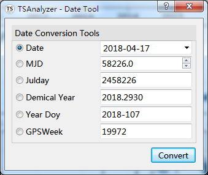
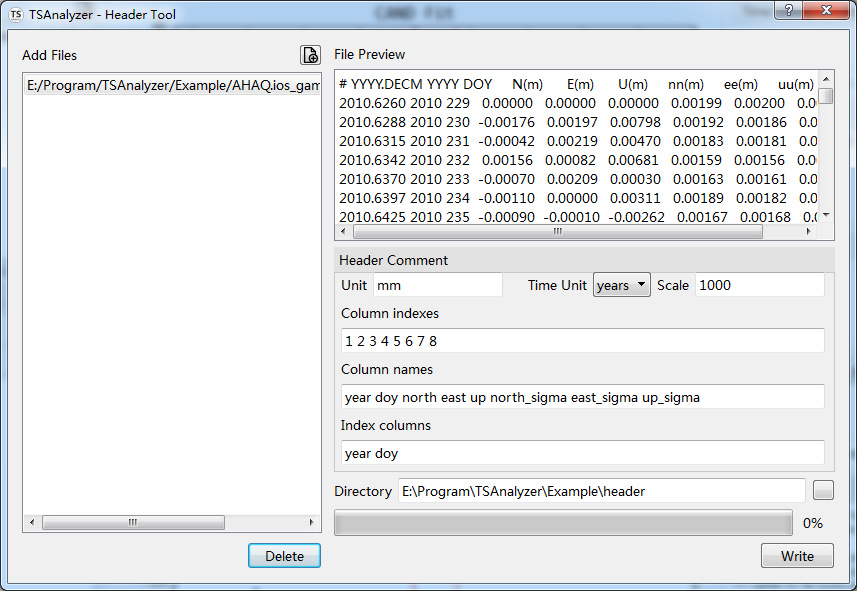

## Introduction

Time series analysis is important in any areas such as finical, astronomy, geophysics and so on. In the geophysics, time series are analyzed to extract the signals caused by geophysics phenomenon. This software is designed to analyze the GNSS coordinates time series and estimated the signals, such as linear, periodical signals. Also, some useful tools are provided for analysis convenience.

## Requirements and Installation

TSAnalyzer V2.0 is based on Python, it supports Python 2 and Python 3, so some requirements should be installed before it launched.

### Requirements

- qtpy
- Matplotlib
- Numpy
- Pandas
- cvxpy (For offset detection, the solver [MOSEK](https://www.mosek.com/downloads/) is better)
- cvxopt

### Installation

Before installing this package, the [Anaconda](https://anaconda.org/) is recommended to be installed. *TSAnalyzer* can support both Python2 and Python3.

- Download this repo,  and `python setup.py install` on common line prompt.
- `pip install tsanalyzer`

After that, the package creates a command `tsanalyzer` in your path.

## GUI Instructions

As TSAnalyzer 2.0 was redesigned and refactoring, we discard some functions, for example, spectrum analysis, sigseg, however the discontinuity detection and interaction ability was enhanced. Also the batch  functions were made easy to use.

### Tool Bar

-  Home plot view (alt+h)
-  Previous plot view
-  Next plot view
-  Pan the figure (alt+p)
-  Zoom the figure (alt+z)
-  Subplot Configuration
-  Figure Settings (lines, markers, colors)
-  Offset (alt+1)
-  Trend Change (alt+2)
-  Earthquake Exponential Relaxation (alt+3)
-  Earthquake Logarithmic Relaxation (alt+4)
-  Save the figure (alt+s)

### Time-Series Files Dock

The files dock support the context menu. Right click the dock, and the file menu will show up. Double click the filename in the dock, this file will be loaded. The `Export all time-series filename` is to save the files name in the dock into a text file.

### Discontinuities Dock

The dock provide edit, import and export functions. The discontinuities dock only display the loaded file's, but the others time series files' discontinuities are also recorded in the memory.

### Time-series Figure

With the tool bar provided, the user can do interaction with the figure. Discontinuities will be added by `left click`, once the user click the figure when the discontinuities actions (offset, trend change, exp decay or log decay) were triggered. When the discontinuity line are hovered, you can `drag` the position to specific date with `middle click` of the mouse, `right click` is to delete the discontinuity.

### Analysis Dock

#### Discontinuity Detection

The mathematical models for L1 Extensive Model is:

$$\text{minize}\quad \frac{1}{2}\lVert \mathbf{y} - \mathbf{x} - \mathbf{s} - \mathbf{w} \rVert_2^2+\lambda \lVert D^{2}\mathbf{x} \rVert_1 + \rho \lVert D^{1}\mathbf{w} \rVert_1$$

where $\mathbf{y}$ is the observation, $\mathbf{x}$ is piecewise trends, $\mathbf{s} = \sum_i(a_i \sin\omega_i t_i + b_i \cos \omega_i t_i)$ is seasonal term, and $\mathbf{w}$ are the level shifts. Here, $D^{n}$ stands for n-th difference matrix. We can use the piecewise trends $\mathbf{x}$ to find trend change points and $\mathbf{w}$ to get potential offset points. Then F-test is used to validate. So the parameters in the groupbox are stands for these parameters.  The offsets and trend change check means give the result of offset or trend change result or not.

The batch button is used to detect discontinuities in the Time-series Dock files. Once the procedure done, click the `import` button to import discontinuities to the `Discontinuity Dock`

#### Outliers

##### Big Sigma Criterion

This criterion is according the sigma (userinput, accepted one or three numbers) to mask out the data whose sigma islarger than sigma criterion to get the cleaner data. One number input meansthat three sigma criterion for all components are the same. If you want tospecific for individual component, please use space between numbers. If sigma is not set, this criterion will not be adopted.

##### IQR

By using the least squares model, one could get the residuals $v$, then the software use the window (user input) to get the percentile of 75%, median and 25%.
$$
| \mathbf{v}_i - \mathbf{v}_{median}| > factor (\mathbf{v}_{75} - \mathbf{v}_{25})
$$

#### Least Squares Analysis

$$
y(t_i) = a + \sum_{i=1}^{n}b_i(t_i-t_0)^i + \sum_{i=1}^{n_p}\left( c_i \sin (2\pi t_i / p_i) + d_i \cos(2 \pi t_i / p_i) \right) + \\ \sum_{i=1}^{n_g}\left(g_i H(t_i - T_{g_j})\right) + \sum_{i=1}^{n_k}\left( h_i(t_i - T_{k_i}) H(t_i -T_{k_i}) \right)+ \\
\sum_{i=1}^{n_l}\left(C_{l_i} + l_i H\ln (1 + \frac{t_i - t_{eq}}{\tau})\right) + \sum_{i=1}^{n_e}\left(C_{e_i} + e_i H (1-e^{(-1(t-t_{eq_i}/\tau))})\right) + v_i
$$

`* if the math equations cannot be rendered, please refer to the pdf file`

In the equation, $b_i$ is polynomials, if $i=1$ for $b_i$, it is the linear trend, $c_i$ and $d_i$ are harmonic components, the $H$ is a step function and $g_i$ can be used to explain the sudden change event caused the equipments or co-seismic, $C_{l_{i}}$ and $C_{e_{i}}$ terms are stand for logarithmic or exponential function to be fit after an Earthquake. These terms are the accumulated post-seismic motion, C is the co-seismic offset, and τ is the decay time.

This model can be used to estimated polynomials (max order is 10), harmonics (users can define the period) as well as step function (including sudden change, post-seismic log or relaxation) at specific times (users pick interactively or input offsets file), detail information is displayed in the picture.

The batch button is also provide the function to analysis all the files in Time-series files dock. The results will be saved in the directory with data and log separately.

### Tools

#### Date Converter

In the GNSS coordinate time series analysis, there are some formats of time are given, so TSAnalyzer provides this tool for convenience.

#### Header Convert Tool

From the Header Comment Tool Figure, there are some parameters should be input.

- Unit, mm abbreviation for millimeter, although the original file’s unit is meter

- Scale, we use scale factor 1000 to convert meter to millimeter.

- Time Unit, years and days supports at present.

- Column indexes andcolumn names, starting from **0** in this example, we use columns year [(1)](https://github.com/wudingcheng/TSAnalyzer/blob/master/doc/undefined), doy (2), north (3), east (4), up (5), north_sigma (6), east_sigma (7) and up_sigma (8).

  Index columns supports the following key words: year, month, day, hour, minute, seconds, doy, ymd, hms, mjd

  1. doy, day of year
  2. ymd, year month day,for example 2010101
  3. hms, hour minute seconds, for example 120000
  4. mjd, Modified Julian Date

- Directory, save new files after adding header comments.

After adding header comments, we could use TSAnalyzer to load these new files.

## End

If this tool can help you, please consider to cite our paper: Wu, D. and H. Yan, et al. (2017). "TSAnalyzer, a GNSS time series analysis software." GPS Solutions 21(3): 1389-1394.

For bugs and suggestion, please open the issues. Thanks.

## Reference

- Anaconda. https://anaconda.org/

- Cvxpy. http://cvxpy.org

- Goudarzi, M. A. and M. Cocard, et al. (2013). "GPS interactive time series analysis software." GPS Solutions 17 (4): 595-603

- Herring, T. (2003). "MATLAB Tools for viewing GPS velocities and time series." GPS Solutions 7 (3): 194-199

- Kim, S. and K. Koh, et al. (2009). "$\ell_1$ Trend Filtering." SIAM Review 51(2): 339-360.

- Little, M. A. and N. S. Jones(2010). Sparse Bayesian step-filtering for high-throughput analysis of molecular machine dynamics. Acoustics Speech and Signal Processing (ICASSP), 2010 IEEE International Conference on, IEEE.

- Matplotlib. http://matplotlib.org/

- MOSEK. https://www.mosek.com/

- Nikolaidis (2002). Observation of geodetic and seismic deformation.

- Numpy. http://numpy.org/

- Pandas. http://pandas.pydata.org/

- PyQt. https://www.riverbankcomputing.com/

- qtpy. https://github.com/spyder-ide/qtpy

- Scipy. http://scipy.org/

- Tian, Y. (2011). "iGPS: IDL tool package for GPS position time series analysis." GPS Solutions 15 (3): 299-303

  ​